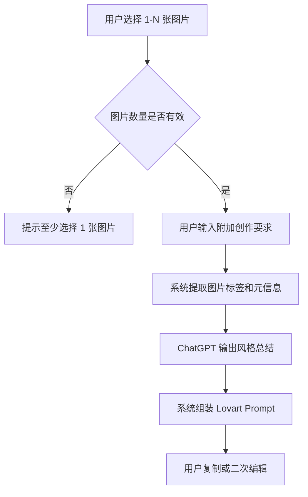

# GalleryArt PRD

| 版本 | 日期 | 修订人 | 备注 |
|---|---|---|---|
| v0.1 | 2026-04-22 | Codex | 首版草案，基于当前想法和合理假设生成 |

## 一、概述

### 1.1 产品概述及目标

#### 1.1.1 背景介绍

创作者、设计师和审美驱动型用户通常会在本地相册、社交平台、截图工具中长期积累大量喜欢的照片和灵感图，但这些图片往往处于“收藏即沉没”的状态：

- 图片来源分散，后续难以查找和复用。
- 即使用户知道自己喜欢某种感觉，也很难准确描述其主题、风格、构图、色彩和氛围。
- 当用户希望把这些灵感图进一步转化为 `Lovart` 可用的创作输入时，往往只能手写 prompt，质量不稳定，复用效率低。

因此需要一个以“灵感归档 + 标签组织 + AI 理解 + Prompt 生成”为核心的产品，帮助用户把照片沉淀为可管理、可检索、可转译的创意资产。

#### 1.1.2 产品概述

`GalleryArt` 是一个围绕个人审美素材管理与 AI 创作辅助的 Gallery 产品。用户可将喜欢的照片按主题、标签、`hashtag` 和集合进行管理，并基于选中的一组图片调用 `ChatGPT` 输出结构化风格总结与 `Lovart` prompt。

本产品第一阶段聚焦两个核心目标：

- 帮用户高质量整理和检索灵感图。
- 帮用户把一组参考图转成可直接用于 `Lovart` 的 prompt。

#### 1.1.3 产品目标

业务目标：

- 验证“图片灵感管理 + AI prompt 生成”场景的真实需求。
- 建立可复用的审美素材库，提升创作链路中的复用率。
- 为后续延展到 moodboard、风格包、个人审美画像打基础。

用户目标：

- 能快速上传并整理自己喜欢的照片。
- 能通过标签、主题和集合迅速找回灵感图。
- 能选中一组图并生成高质量、可复用的 `Lovart` prompt。

阶段性成功标准：

- 用户完成首次图片导入并至少创建 1 个集合。
- 用户成功对 1 组图片生成 prompt。
- 用户有能力复用历史 prompt 或编辑后再次生成。

#### 1.1.4 目标用户

核心用户：

- 视觉设计师
- 品牌与营销创意人员
- 内容创作者
- 喜欢收集视觉灵感的个人用户

次级用户：

- 电商视觉从业者
- AI 生成内容探索者
- 需要整理审美参考图的自由职业者

### 1.2 名词说明

| 名词 | 说明 |
|---|---|
| Gallery | 用户管理图片的主界面，支持浏览、筛选和搜索 |
| Photo | 用户上传的一张图片素材 |
| Collection | 用户按主题组织的一组图片集合 |
| Tag | 标签，支持主题、风格、颜色、情绪、场景等维度 |
| Hashtag | 带 `#` 的轻量标签，用于快速分类与检索 |
| Prompt Job | 一次基于图片和用户补充要求生成 prompt 的记录 |
| Lovart Prompt | 面向 `Lovart` 使用场景的创作提示词 |

### 1.3 角色及权限

当前版本默认单用户使用，暂不引入复杂协作角色。

| 角色 | 权限 |
|---|---|
| 普通用户 | 上传图片、编辑标签、创建集合、生成 prompt、复制 prompt |
| 系统 | 自动分析图片元信息、生成 AI 标签、保存 prompt 记录 |

`[待确认]` 后续是否支持多用户协作、共享收藏夹或团队空间。

### 1.4 文档阅读对象

- 产品经理
- 设计师
- 前端工程师
- 后端工程师
- AI 能力接入开发者

## 二、产品描述

### 2.1 产品需求描述

用户有大量喜欢的照片，希望：

1. 将图片按主题和风格沉淀为长期可复用资产。
2. 用标签和 `hashtag` 快速定位想要的灵感。
3. 选中若干图片后，借助 `ChatGPT` 理解其共同风格。
4. 输出适用于 `Lovart` 的高质量 prompt。

产品需要支持以下能力：

- 图片导入与基础管理
- 标签体系与集合管理
- Gallery 检索与筛选
- 多图理解与风格总结
- Prompt 生成、编辑、复制与历史沉淀

### 2.2 产品整体流程

#### 2.2.1 主流程


#### 2.2.2 Prompt 生成子流程



#### 2.2.3 数据流说明

- 用户上传图片后，系统保存原图地址、缩略图地址和基础元数据。
- 用户可手动维护标签、备注和集合归属。
- Prompt 生成时，系统将图片选择结果、标签、备注和用户附加要求一并传递给 AI 服务。
- AI 服务返回结构化分析结果和最终 prompt，系统保存生成记录。

### 2.3 全局说明

#### 2.3.1 全局交互规则

- 图片卡片支持悬停、选中、多选。
- 标签支持点击筛选和输入建议补全。
- 生成 prompt 前应明确展示已选图片数量和当前生效标签。
- 所有关键操作完成后应有明确反馈，例如“上传成功”“已保存”“已复制”。

#### 2.3.2 异常处理规则

- 上传失败：提示失败原因并允许重试。
- 图片解析失败：保留文件名并提示重新上传。
- AI 生成失败：展示错误提示，并允许再次生成。
- 网络异常：采用 toast 提示，当前数据不应丢失。

#### 2.3.3 空状态规则

- Gallery 无图片时，展示引导上传态。
- Collection 无内容时，展示“添加图片到该集合”引导。
- 搜索无结果时，展示清空筛选入口。
- Prompt 历史为空时，展示推荐示例。

### 2.4 产品版本规划

#### V1.0 MVP

- 图片上传
- 标签与 `hashtag`
- Collection 管理
- Gallery 筛选浏览
- 多图生成 `Lovart` prompt
- Prompt 历史记录

#### V1.1

- AI 自动推荐标签
- Prompt 多版本生成
- Prompt 收藏与复用
- 图片批量操作

#### V1.2

- Moodboard 输出
- 个人风格画像
- 共享 Collection
- 结果回流管理

### 2.5 产品框架

建议首版页面结构如下：

- `Gallery 首页`
- `Collection 详情页`
- `Photo 详情抽屉/详情页`
- `Prompt Studio 页面`
- `Prompt History 页面`

### 2.6 功能清单

| 功能模块 | 子功能 | 优先级 |
|---|---|---|
| 图片管理 | 上传、删除、编辑标题、备注 | P0 |
| 标签系统 | 手动标签、`hashtag`、标签筛选 | P0 |
| Collection | 创建、编辑、加入/移出图片 | P0 |
| Gallery 浏览 | 搜索、筛选、排序、多选 | P0 |
| Prompt 生成 | 多图分析、附加要求输入、结果输出 | P0 |
| Prompt 沉淀 | 历史记录、复制、再次编辑 | P1 |
| AI 标签建议 | 自动补充标签 | P1 |

## 三、功能需求

### 3.1 图片管理模块

#### 3.1.1 功能描述

支持用户上传本地图片，维护图片标题、备注、标签和集合归属。

#### 3.1.2 用户故事

作为一个喜欢收集灵感图的用户，我希望把喜欢的照片上传到系统，并补充基础信息，以便后续检索和生成 prompt。

#### 3.1.3 前置条件

- 用户已进入产品首页。
- 用户具备本地图片文件。

#### 3.1.4 后置条件

- 图片被成功保存。
- 图片出现在 Gallery 中。

#### 3.1.5 界面与交互

- 上传入口：主按钮，支持单张与多张。
- 图片预览：上传后即时预览缩略图。
- 编辑项：标题、备注、标签、`hashtag`、所属集合。
- 保存逻辑：自动保存或点击“完成”保存，`[待确认]` 建议首版采用显式保存。

#### 3.1.6 业务流程

1. 用户点击上传。
2. 系统校验文件格式和大小。
3. 上传成功后展示编辑表单。
4. 用户补充标题、备注、标签。
5. 系统保存并加入 Gallery。

#### 3.1.7 异常/分支流程

- 不支持格式：提示“仅支持 jpg/png/webp”。
- 文件过大：提示压缩或更换图片。
- 上传中断：可重新上传，不清空已填写文案。

#### 3.1.8 数据字典

| 字段名 | 类型 | 必填 | 说明 | 示例 |
|---|---|---|---|---|
| photo_id | string | 是 | 图片唯一 ID | `p_10001` |
| image_url | string | 是 | 原图地址 | `/uploads/p_10001.jpg` |
| title | string | 否 | 图片标题 | `法式静物参考` |
| note | string | 否 | 用户备注 | `喜欢这种留白和灰调` |
| tags | string[] | 否 | 标签数组 | `["极简","静物"]` |
| hashtags | string[] | 否 | hashtag 数组 | `["#editorial","#clean"]` |
| collection_id | string | 否 | 所属集合 ID | `c_001` |

### 3.2 标签与 Collection 模块

#### 3.2.1 功能描述

支持用户以主题、标签和集合的方式组织图片。

#### 3.2.2 用户故事

作为用户，我希望把图片按主题或风格归类，方便后续统一浏览和批量生成 prompt。

#### 3.2.3 前置条件

- 用户已有至少 1 张图片。

#### 3.2.4 后置条件

- 图片与标签、集合建立关联。

#### 3.2.5 界面与交互

- `Collection` 列表支持创建、重命名、删除。
- 标签输入支持回车创建与推荐补全。
- `hashtag` 与普通标签分开展示，但在搜索时可统一命中。

#### 3.2.6 业务流程

1. 用户创建集合。
2. 用户选中图片并加入集合。
3. 用户为图片或集合添加标签。
4. 系统更新索引。

#### 3.2.7 异常/分支流程

- 集合名称为空：禁止保存。
- 重名集合：允许重名，但建议提醒用户。
- 删除集合：不删除图片，仅解除归属。

#### 3.2.8 数据字典

| 字段名 | 类型 | 必填 | 说明 | 示例 |
|---|---|---|---|---|
| collection_id | string | 是 | 集合唯一 ID | `c_001` |
| name | string | 是 | 集合名称 | `Quiet Luxury` |
| description | string | 否 | 集合说明 | `极简高级的品牌视觉参考` |
| cover_photo_id | string | 否 | 封面图 ID | `p_10001` |
| tag_ids | string[] | 否 | 集合标签 | `["t_01","t_02"]` |

### 3.3 Gallery 浏览与筛选模块

#### 3.3.1 功能描述

支持用户以卡片流方式浏览全部图片，并按多维条件筛选。

#### 3.3.2 用户故事

作为用户，我希望通过主题、标签和关键词快速定位图片，而不是在海量收藏里反复翻找。

#### 3.3.3 前置条件

- 系统中存在已上传图片。

#### 3.3.4 后置条件

- 用户定位到目标图片或目标图片组。

#### 3.3.5 界面与交互

- 支持搜索框、标签栏、集合切换。
- 支持排序：最新上传、最近使用、手动置顶。
- 支持多选模式，用于批量生成 prompt。

#### 3.3.6 业务流程

1. 用户进入 Gallery。
2. 系统默认展示全部图片。
3. 用户通过标签或关键词筛选。
4. 用户选择一组图片进入生成流程。

#### 3.3.7 异常/分支流程

- 搜索词为空：显示默认结果。
- 无匹配结果：显示空状态与推荐标签。
- 图片数量过大：采用懒加载。

### 3.4 Prompt Studio 模块

#### 3.4.1 功能描述

支持用户选择多张图片，并调用 `ChatGPT` 生成结构化分析和 `Lovart` prompt。

#### 3.4.2 用户故事

作为用户，我希望系统不是简单描述图片，而是提炼多张图的共性风格，帮我生成一段更像我审美的 `Lovart` prompt。

#### 3.4.3 前置条件

- 用户已选择至少 1 张图片。

#### 3.4.4 后置条件

- 系统输出结构化分析和最终 prompt。
- 用户可复制或继续编辑。

#### 3.4.5 输入项

| 输入项 | 控件类型 | 必填 | 说明 |
|---|---|---|---|
| 已选图片 | 图片列表 | 是 | 至少 1 张，建议 3-9 张 |
| 附加要求 | 多行输入框 | 否 | 例如“偏海报感”“更商业化” |
| 输出语言 | 单选 | 否 | 默认英文，可切换中英双语 |
| 生成模式 | 单选 | 是 | 忠实提炼 / 风格融合 / 延展创作 |

#### 3.4.6 输出内容

- 风格总结
- 核心关键词
- 色彩与氛围描述
- 构图与视觉语言
- `Lovart Prompt`

#### 3.4.7 业务流程

1. 用户确认已选图片。
2. 用户输入附加要求。
3. 系统整合图片标签、备注和集合信息。
4. 调用 AI 服务。
5. 返回分析结果和 prompt。
6. 用户复制、保存或再次编辑。

#### 3.4.8 异常/分支流程

- 未选择图片：禁用生成按钮。
- AI 服务超时：展示“重新生成”。
- 返回内容过短：允许用户补充要求后再次生成。
- 连续点击生成：按钮置灰，避免重复提交。

#### 3.4.9 Prompt 模板建议

系统内部建议采用如下结构化指令：

```text
请基于用户选择的多张参考图片，提炼共同的视觉语言，而不是逐张描述图片内容。

请输出：
1. 风格总结
2. 核心关键词（10-15 个）
3. 色彩与氛围描述
4. 构图与镜头语言
5. 适合 Lovart 的最终 Prompt（英文优先）

补充要求：
- 用户提供的附加要求优先纳入
- 语言需具体、具有创意指导性
- 避免空泛形容词
```

#### 3.4.10 数据字典

| 字段名 | 类型 | 必填 | 说明 | 示例 |
|---|---|---|---|---|
| job_id | string | 是 | 生成任务 ID | `job_001` |
| photo_ids | string[] | 是 | 参与生成的图片 ID 列表 | `["p_1","p_2"]` |
| extra_requirement | string | 否 | 用户补充要求 | `高端品牌海报感` |
| mode | string | 是 | 生成模式 | `fusion` |
| output_prompt | string | 是 | 最终 prompt | `minimal luxury editorial...` |
| status | string | 是 | 任务状态 | `success` |

### 3.5 Prompt History 模块

#### 3.5.1 功能描述

保存历史生成记录，支持复制、收藏、再次编辑。

#### 3.5.2 用户故事

作为用户，我希望历史生成结果可以被复用，而不是每次重新组织和输入。

#### 3.5.3 关键规则

- 每次成功生成后默认写入历史记录。
- 历史记录应关联图片集合和时间。
- 用户可基于历史结果再次生成新版本。

#### 3.5.4 异常/分支流程

- 删除历史记录前二次确认。
- 复制失败时显示备用手动复制方案。

## 四、非功能需求

### 4.1 安全与合规

- 用户上传图片仅用于用户个人管理和 prompt 生成。
- `ChatGPT` 接口调用时应明确图片和文本的使用边界。
- 涉及外部模型服务时，需在产品内提供隐私说明。
- `[待确认]` 是否需要支持用户手动删除所有上传数据。

### 4.2 统计需求

#### 核心页面埋点

| 事件名 | 触发时机 | 关键属性 |
|---|---|---|
| gallery_view | 进入 Gallery 首页 | 用户 ID、图片总数 |
| photo_upload_click | 点击上传按钮 | 页面来源 |
| photo_upload_success | 上传成功 | 文件数量、格式 |
| collection_create | 创建集合成功 | 集合名称长度 |
| tag_add | 添加标签成功 | 标签类型 |
| prompt_generate_click | 点击生成按钮 | 图片数量、模式 |
| prompt_generate_success | 生成成功 | 耗时、输出长度 |
| prompt_copy | 复制 prompt | 任务 ID |

#### 异常事件埋点

| 事件名 | 触发时机 | 关键属性 |
|---|---|---|
| photo_upload_fail | 上传失败 | 错误码、文件格式 |
| prompt_generate_fail | AI 生成失败 | 错误码、模式 |

### 4.3 性能需求

- Gallery 首屏图片列表建议在 2 秒内完成渲染。
- Prompt 生成建议在 10 秒内返回。
- 大量图片场景需支持分页或懒加载。
- `[待确认]` 图片上传大小上限建议首版设为单张 20MB。

### 4.4 数据库设计

建议核心表：

- `photos`
- `collections`
- `tags`
- `photo_tag_relations`
- `prompt_jobs`

建议关系：

- 一张图片可关联多个标签。
- 一张图片可归属于多个集合，`[待确认]` 首版是否限制单图只属于一个主集合。
- 一个 prompt job 对应多张图片。

### 4.5 系统集成

- 图片存储服务：用于原图与缩略图存储。
- `ChatGPT` 服务：用于多图风格理解和 prompt 生成。
- `Lovart`：首版不做 API 深度集成，先聚焦 prompt 输出和复制。
- `[待确认]` 后续是否需要一键发送至 `Lovart`。

## 五、附录

### 5.1 验收标准与测试要点

#### 验收标准

1. 用户可成功上传至少 1 张图片并完成保存。
2. 用户可创建 Collection，并将图片加入该集合。
3. 用户可使用标签或关键词在 Gallery 中筛选图片。
4. 用户选择图片后可成功生成 `Lovart` prompt。
5. 用户可复制历史 prompt，并查看历史记录。

#### 测试要点

- 上传格式校验是否正确。
- 标签增删改查是否即时生效。
- 多选图片后生成逻辑是否稳定。
- AI 失败、超时和空结果场景是否有兜底提示。
- Prompt 历史是否与原图正确关联。

## 待确认项清单

### 必须确认

1. `[待确认]` 是否支持多用户协作或共享空间。
2. `[待确认]` 首版图片上传是否采用自动保存还是显式保存。
3. `[待确认]` 单张图片是否允许加入多个 Collection。
4. `[待确认]` 是否需要一键发送 Prompt 到 `Lovart`，还是只支持复制。

### 建议确认

5. `[待确认]` 图片上传大小上限是否采用 20MB。
6. `[待确认]` Prompt 输出默认语言是英文，还是中英双语。
7. `[待确认]` 是否需要 AI 自动推荐标签作为 V1 功能。

### 可后续补充

8. `[待确认]` 是否支持用户生成结果反向沉淀为新的标签或风格包。
9. `[待确认]` 是否需要接入分享、导出或 moodboard 能力。
